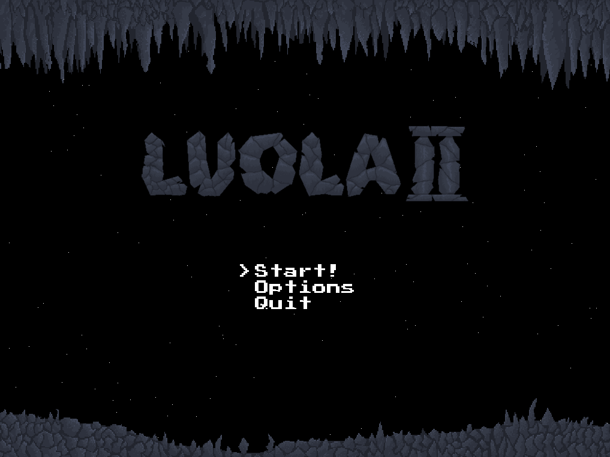

Luola II
--------

A fast-paced cave flying splitscreen game for 2+ players.

Luola II is a modernized remake of the original [Luola](https://github.com/callaa/luola), which itself was a clone of/homage to the cave flyers popular in the Finnish shareware scene of the mid 1990s.

Features:

 * Splitscreen play for 2+ players
 * Configurable key bindings for 4 players
 * Lua scripting, including per-level custom scripts
 * 5 special weapons to choose from
 * Destructible terrain
 * 100% artisanal code and art: no gen-AI used!

## Roadmap to 1.0.0

The "finished" 1.0 version will have all the good features from Luola, as well as few new ones.

Planned features:

 * Gamepad support
 * More special weapons (including gravity weapons, terrain modifiers, more mine types, etc.)
 * Multiple selectable ship types
 * Pilot ejection
 * Sound effects & music (pending release of SDL Mixer 3)
 * Special playmodes such as timed battle with sudden death
 * Neutral and hostile critters: birds, fish, tanks and drones
 * Neutral and hostile stationary objects: jump gates and turrets
 * Special terrain modification effects such as: burning, freezing, dissolving, expanding foam
 * An official level set (aside from the engine demo leves)

## Instructions

**Key bindings:** up to 4 players can share a keyboard. The bindings can be edited in the Controls menu.

The following keys can be used in menus:

 * Arrow keys: move cursor
 * Enter, or any player's Fire1 button: select menu item
 * Esc: return to previous menu or end round
 * F12: toggle debug mode

**Ship controls:**

 * Turn the ship with Left/Right keys or right thumbstick
 * Accelerate with the Up key or left thumbstick.
 * Fire primary weapon (unlimited ammo) with Fire1 key (East button or right trigger on gamepads)
 * Fire secondary weapon with Fire2 key (South button or left trigger on gamepads.)
 * Land on a base to repair and rearm

**Pilot controls:**

 * Walk/parachute/swim with the left thumbstick or WASD
 * Shoot with Fire1 button (gamepad East/right trigger)
 * Jump/jetpack with Up key or gamepad North button
 * Activate parachute and/or aiming mode by holding down Fire2 (gamepad South/left trigger)

**Winning:**

 * Number of rounds needed to win the game can be set with Left/Right keys in the player selection screen
 * Last player left wins the round
 * If all players are destroyed, the round ends in a draw

## Build instructions

Dependencies:

 * Rust compiler
 * SDL 3
 * SDL 3 Image
 * SDL 3 TTF

Install the Rust compiler and dev packages for SDL libraries.
Run `cargo build --release` to build an optimized release binary, or
`cargo run` to quickly just run the game! (Tip: make a symlink from `data` to `target/debug/data`)
The game will look for the `data` directory in the following places:

 * Same directory as the executable
 * Location explicitly specified with the `--data <path>` argument (TODO)
 * Linux: XDG data directory (`~/.local/share/io.github.callaa.luola2/luola2/`) (TODO)
